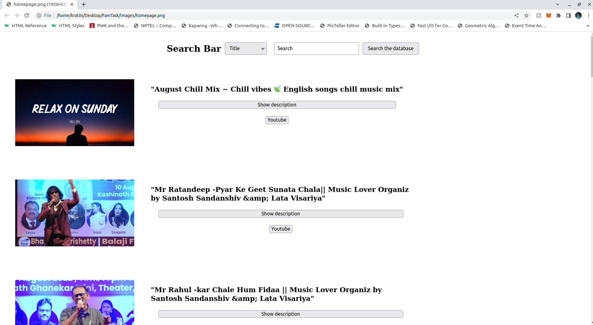
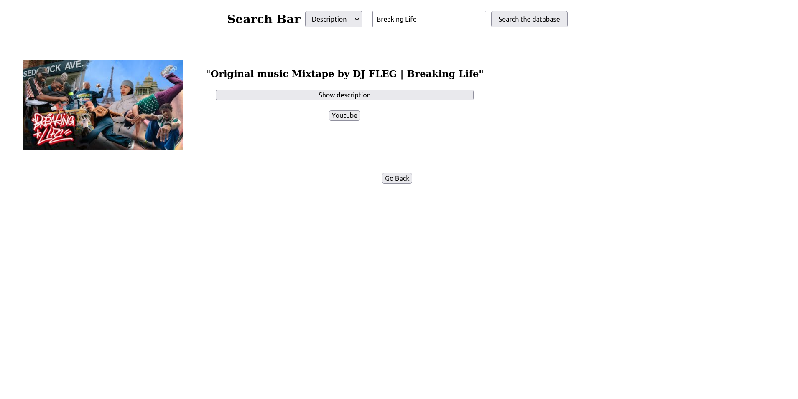
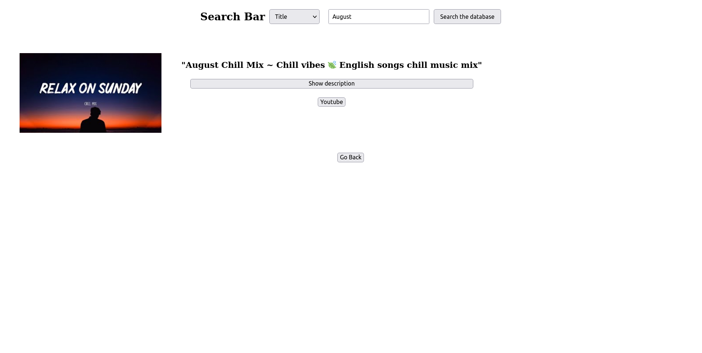
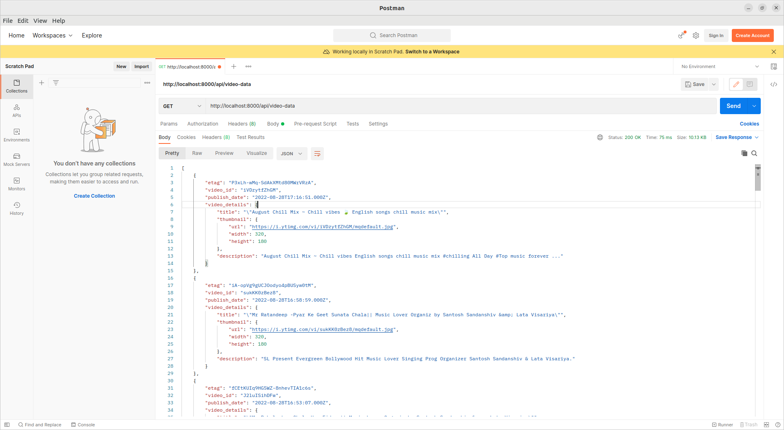
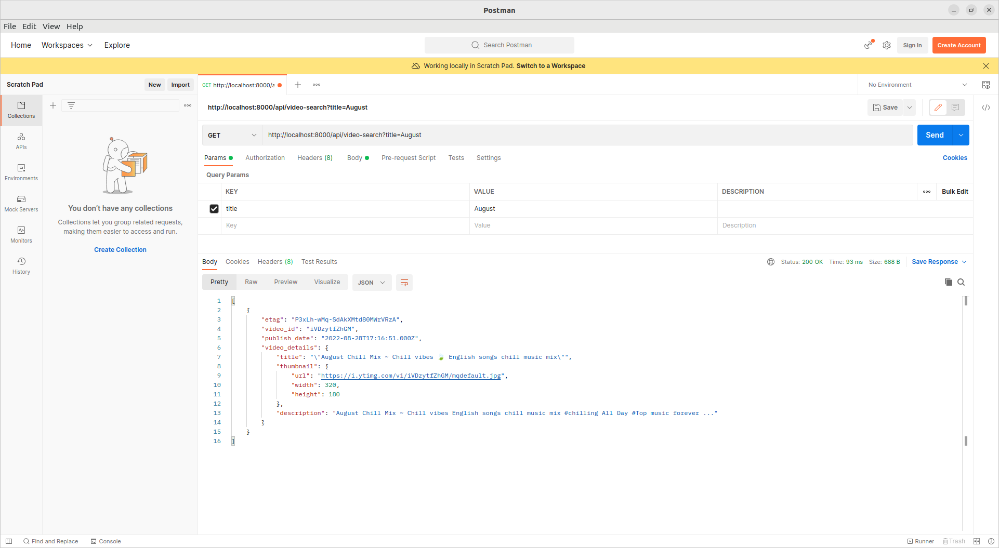

# Youtube Video Fetcher

## App's Aim :

To fetch latest sorted  videos in reverse chronological order of their publishing dates from youtube for a given query (music) and return the result in a paginated format.

## Tasks performed by the app :

1. Calls the YouTube api continously in background in intervals of two minutes to fetch the latest videos for some predefined search query (currently set to music).
2. Provides a <b> GET </b> api endpoint to show the stored video data in a  paginated response sorted in descending order of published datetime.
3. Provides a <b>Search </b> api endpoint to search the videos from the database usinging their title and description.
4. Provides a very <b> Basic </b> dashboard to interact with the stored data using the endpoints implemented as a search bar also has a button that redirects to the youtube link of the thumbnail video. 
5. Provides a mediocre level <b> Optimized </b> search, that is able to query and provide the video even if the search words are jumbled.

 

# Firing up the App

## Downloading Docker :

Download docker from the official <a href="https://docs.docker.com/get-docker/">docker site</a> . The following guidelines are for the Linux OS ( Ubuntu 22.04 LTS Jammy Jellyfish).

## Prerequsite to install Docker :

1.  Uninstall the tech preview or beta version of Docker Desktop for Linux. Run:
 > <code>\$ sudo apt remove docker-desktop </code>
2. For a complete cleanup, remove configuration and data files at <code>\$HOME/.docker/desktop</code>, the symlink at <code> /usr/local/bin/com.docker.cli</code>, and purge the remaining systemd service files.
><code>\$ rm -r $HOME/.docker/desktop</code> 
><code>\$ sudo rm /usr/local/bin/com.docker.cli</code> 
><code>\$ sudo apt purge docker-desktop</code>

- Additionally, for non-Gnome Desktop environments, gnome-terminal must be installed:
> <code>\$ sudo apt install gnome-terminal </code>

## Installing Docker :

### Setting up the repository :
1. Update the apt package index and install packages to allow apt to use a repository over HTTPS:
><code>\$ sudo apt-get update </code> 
><code>\$ sudo apt-get install \\ 
    &nbsp;&nbsp;&nbsp;ca-certificates \\ 
    &nbsp;&nbsp;&nbsp;curl \\ 
    &nbsp;&nbsp;&nbsp;gnupg \\ 
    &nbsp;&nbsp;&nbsp;lsb-release </code> 

2. Add Docker's official GPG key :
><code>\$ sudo mkdir -p /etc/apt/keyrings</code> 
><code>\$ curl -fsSL https://download.docker.com/linux/ubuntu/gpg | sudo gpg --dearmor -o /etc/apt/keyrings/docker.gpg</code> 
3. Use the following command to set up the repository:
><code>\$ echo \\ 
    &nbsp;"deb [arch=$(dpkg --print-architecture) signed-by=/etc/apt/keyrings/docker.gpg] https://download.docker.com/linux/ubuntu \\ 
    &nbsp;\$(lsb_release -cs) stable" | sudo tee /etc/apt/sources.list.d/docker.list > /dev/null</code> 

### Installing Docker Engine:

- Update the apt package index, and install the latest version of Docker Engine, containerd, and Docker Compose, or go to the next step to install a specific version:

><code>\$ sudo apt-get update</code> 
><code>\$ sudo apt-get install docker-ce docker-ce-cli container.io docker-compose- plugin</code>

### Troubleshooting the installation:
 
Please refer official Docker Docs for detailed procedure and erors faced during the installing and also checkout other methods of installing docker.

## Using the App :

1. Clone the repository into your desktop
2. Change the directory path to the source folder
3. Write <code>\$ sudo docker compose up</code> in the terminal to execute the docker - image.
4. Open any javascript enabled web browser type in the location bar <I>http://localhost:5000/ </I> 
5. Close the docker compose terminal by pressing ctrl+c.

## App snapshots :
 
Website homepage.
 
 
 Search Page (search by title).
 
   
 Search Page (search by description).
 
 
 JSON response from the backend server (video listing).
 
 
 JSON response Search Page (search by title).
 
 

# Common problem avoidance :

### Make sure that no other apps or servers are occupying the posrt namely:
    - 8000 ( Project's backend runs on this port ).
    - 5000 ( The website is hosted on this port ).
    - 5432 ( the postgresql database runs on htis port . Important : close any pgSQL instances running on the system ).

- ### While searching for specific filter in search bar make sure to not leave any trailing spaces as they are not handled currently
 
 

# App Stack :

## Frontend :
-  HTML (Hyper Text Markup Language)
-  Javascript
-  CSS (Cascading Styling Sheets)

## Backend :
 - Node JS . Node JS libraries that are used are : - 
    - ExpressJS
    - CORS
    - PG ( for accessing pgSQL from NodeJS )
    - PG - FORMAT ( for formatting pgSQL queries )

## Database :
-   PostgresQL

updating ......

#
### Made with :heart: by Amardeep Saha (<a href="https://github.com/alpha-coder13">alpha-coder13</a>)

#